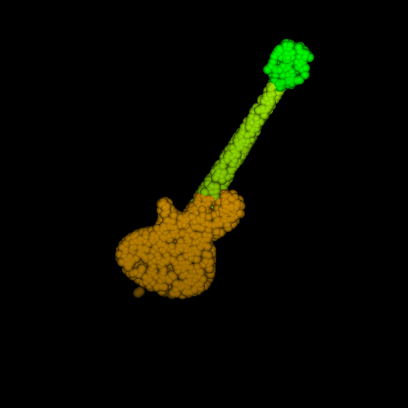

# pointnet
## Dataset
Download dataset from https://shapenet.cs.stanford.edu/ericyi/shapenetcore_partanno_segmentation_benchmark_v0.zip
## Train  
Before training classification or segmentation tasks, you first need to start visdom with the following command:  
```
python -m visdom.server
```
### Classification 
First, you need to configure the following items in train_cls.py  
```
root = r"./shapenetcore_partanno_segmentation_benchmark_v0"
epoch = 100
train_batch_size = 16
test_batch_size = 64
lr = 0.001
lr_de_rate = 0.5
lr_de_epoch = [20, 30, 50, 70]
print_loss_accu_every_step = 100
npoints = 2500
num_workers = 4
only_test = True
rand_seed = 123
```  
Then execute the following command for model training  
```
python train_cls.py
```
### Segmentation  
First, you need to configure the following items in train_seg.py  
```
root = r"./shapenetcore_partanno_segmentation_benchmark_v0"
epoch = 200
train_batch_size = 4
test_batch_size = 32
lr = 0.01
lr_de_rate = 0.5
lr_de_epoch = [20, 40, 60, 80, 100, 120, 140, 160]
print_loss_iou_every_step = 10
npoints = 2500
num_workers = 4
only_test = False
rand_seed = 123
class_choice = ["Guitar"]  # segmentation task need  specify one class, should be a list, for example ["class1"]
```
Then execute the following command for model training  
```
python train_seg.py
```
## Show Segmentation Result  
## Segmentation Results  
<p float="left">
  
  
  
  
</p>
<p float="left">
  
  
  
  
</p>

