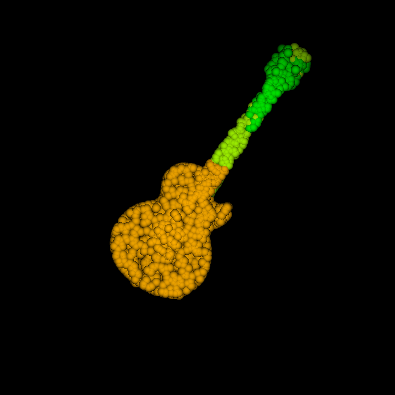
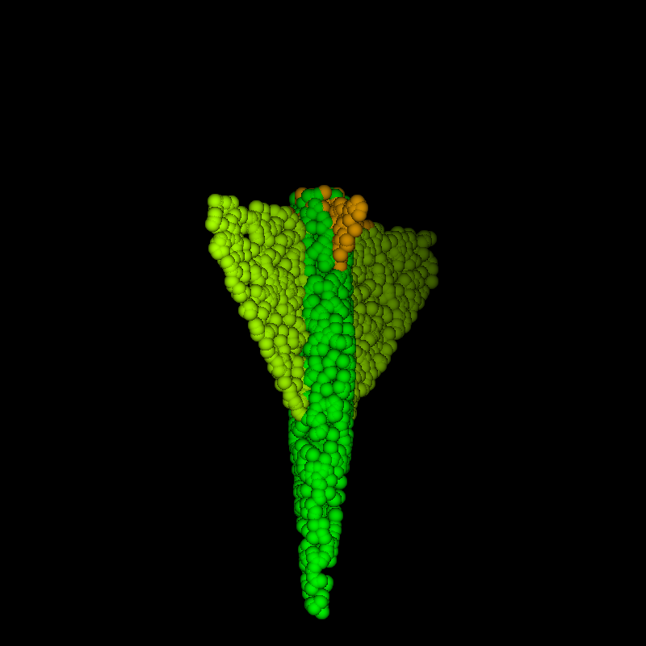

# pointnet
## Train  
Before training classification or segmentation tasks, you first need to start visdom with the following command:  
```
python -m visdom.server
```
### Classification  
### Segmentation  
## Show Segmentation Result  
## Segmentation Results  
<p float="left">
  
  
  
  
</p>
<p float="left">
  
  
  
  
</p>

